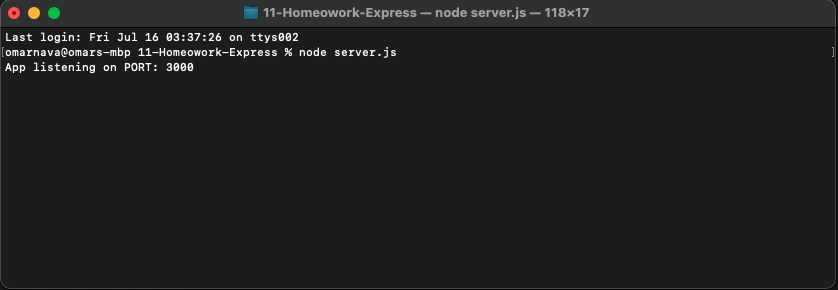

# Note Taker

## Description
Note Taker is a simple application allowing the user to save notes and review notes for later use.

## Installation
To run application you will need to install **node.js** along with the **Express** package.

## Links
- Deployed Application:
https://omar-note-taker.herokuapp.com/

- Video Walkthrough: 
https://drive.google.com/file/d/1thlI-Pw55u1ACDFp3_RrP-XxNEfpOgMy/view

- GitHub Repository:
https://github.com/omar-94/note-taker

## Technologies
- Javascript
- Node.js
- Express

## Contact 
Omar Nava  
enava23@yahoo.com  
https://github.com/omar-94  